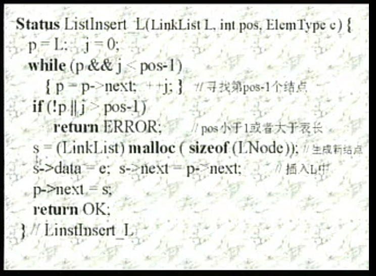

# 线性结构

## 基本特征

有次序的集合

* 集合中必存在位移的一个“第一元素”
* ~~~~~~~~~~~~~~~~~~~~~“最后元素”
* 除最后元素在外，均有唯一的后继
* 除第一元素外，均有位移的前驱

## 线性表

### 定义

数据对象
数据关系

{a1,a2,a3,...,ai,....,an}

### 基本操作

结构初始化 InitList(&L) 构造一个空的线性表L
销毁结构  DestroyList(&L)
引用型操作  不改变线性结构
加工型操作 改变现行结构

### 顺序映象

* 定义

* 初始化

* 线性表操作

插入

删除

### 链式映象

单链表
元素（数据元素的映象）+指针（指示后继元素粗出位置）=节点
节点的序列-链表

* 定义

* 操作

* 生成

### 

